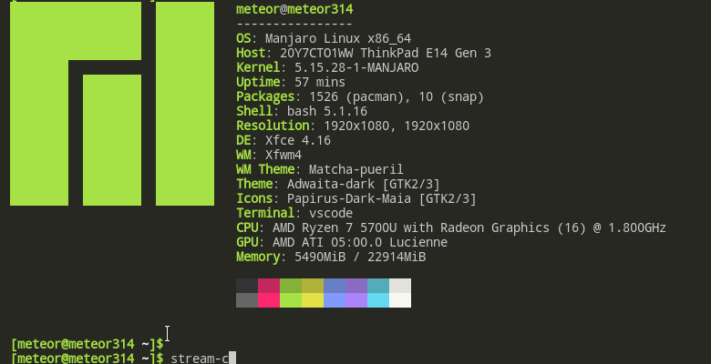

# This program is depreacted, please use <a href="https://github.com/meteor314/ny-cli">ny-cli</a> with some add functionality and many bugs fixes </h1>

<div align='center'>
<h1>stream-cli <br /></h1>
</div>
<p align="center">A  tool which search magnet links and stream it with stream.The idea came while watching <a href='https://github.com/Bugswriter/notflix'>notflix</a> and the latter I found very buggy so I made mine based on the piratebay much more complete and functional.
</p>

### How does this work?



This is a shell script. It scape Piratebay and get the magnet link.
After this it use <b><i>peerlix </i></b> to stream the video from magnet link.
For scraping script use simple gnu utils like sed, awk, curl.

## Requirements

You need <b>NPM</b>. You can follow this tutorial if you don't have node alreday installed.
* [node](https://www.geeksforgeeks.org/installation-of-node-js-on-linux/) - Installation of Node.js on Linux 
* [stream](https://github.com/meteor314/stream) - A tool to stream torrent. 
```sh 
npm install @meteor314/stream -g
```


## Installation

### Linux

cURL **stream-cli** to your **$PATH** and give execute permissions.

```sh
sudo curl -sL "https://raw.githubusercontent.com/meteor314/stream-cli/master/stream-cli" -o /usr/local/bin/stream-cli
sudo chmod +x /usr/local/bin/stream-cli
```
## Windows 
You need scoop to install on your.<b><i> </i> </b>you can find a complete documentation [here.](https://scoop.sh/)
The easiest way to install it is to open powershell (as a simple user) and jsut paste these command :

```sh
Set-ExecutionPolicy RemoteSigned -scope CurrentUser
```
```sh
Invoke-Expression (New-Object System.Net.WebClient).DownloadString('https://get.scoop.sh')
```
```sh
scoop bucket add extras
```

```sh
git clone https://github.com/meteor314/stream-cli.git 
```

```sh
cd stream-cli
```

```sh
scoop install stream-cli
```
```sh
npm install @meteor314/stream -g
```

## MAC OS
//TO DO

## Android
Install [termux](https://termux.com/) and Install [mpv-android](https://github.com/mpv-android/mpv-android/releases)
Don't forget to give termux file manager access. And just copy and paste this command:

```sh
pkg update
pkg install nodejs
npm install @meteor314/stream -g
pkg install fzf
pkg install git
git clone https://github.com/meteor314/stream-cli && cd stream-cli
cp stream-cli $PREFIX/bin/stream-cli
echo 'am start --user 0 -a android.intent.action.VIEW -d "$2" -n is.xyz.mpv/.MPVActivity' > $PREFIX/bin/mpv
chmod +x $PREFIX/bin/mpv
```

## MAC OS 
//TO DO


# How to use ?
Juste write 

```sh
stream-cli 
# stream-cli -h for help
```
- To update, 
```sh
stream-cli --update
```
## How to delete ?
Remove path from local/bin
```sh
sudo rm -rf /usr/local/bin/stream-cli
```
## Issue 
If you are using first time, you can get an error, plese retry with diffrent torrent.

## TO DO / WISH LIST

- [✓] Compatibilty with windows.
- [✓] Download torrent in a specific folder (with stream-cli -d)
- [] Send notification after download ( notify-send(?) ) for W10, Mac & Linux.
- [] Compatibility with mac os.
- [] Fix bugs with git bash in W10
- [] Make a history of all torrent in ./.cache/history.ini
- [] Detect files formats, for example, if it is a zip file or .exe just download it, don't try to open with mpv
- [] add vlc player.
- [✓] Create a custom node webserver based on webtorrent for a better compatibility.


## License
This project is licensed under [GPL](https://raw.githubusercontent.com/meteor314/ny-cli/master/LICENSE).

<i>Please read [Disclaimer.md](https://github.com/meteor314/ny-cli/blob/master/Disclaimer.md) before any usage. Happy torrent :) <i>

<h3 style='color:pink'>
Just keep in mind that :
"Video playing time may vary depending on torrent availability, or may not play if torrent is old and there are no seeders."
</h3>

#### If you encounter a bug, don't hesitate to open an issue, and any help will be welcome ^_^


